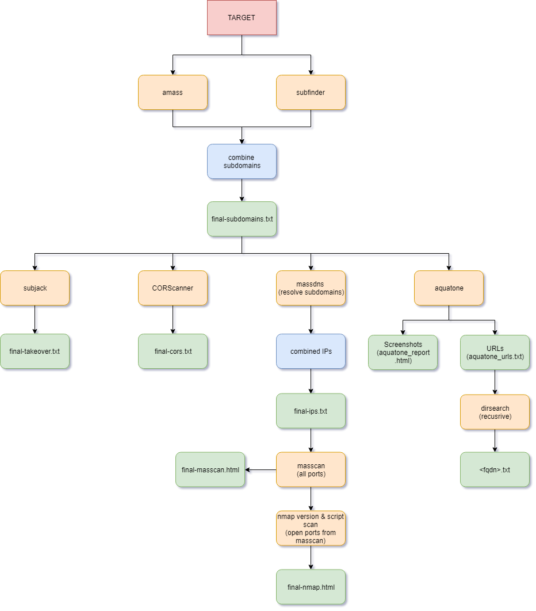

# LazyRecon
[]()
[](https://github.com/capt-meelo/LazyRecon/blob/master/LICENSE)

LazyRecon is a wrapper of various scripts that automates the tedious process of reconnaissance of a target domain. 

LazyRecon utilizes the following tools:
- Subdomain Enumeration:
  - [Amass](https://github.com/OWASP/Amass)
  - [Subfinder](https://github.com/subfinder/subfinder)
  - [Massdns](https://github.com/blechschmidt/massdns)
  - [subjack](https://github.com/haccer/subjack)
- IP Discovery:
  - [Massdns](https://github.com/blechschmidt/massdns)
  - [IPOsint](https://github.com/j3ssie/IPOsint)
- Port Scanner:
  - [Masscan](https://github.com/robertdavidgraham/masscan)
  - [Nmap Bootstrap Stylesheet](https://github.com/honze-net/nmap-bootstrap-xsl/)
- Visual Recon:
  - [Aquatone](https://github.com/michenriksen/aquatone)
- Content Discovery:
  - [Gobuster](https://github.com/OJ/gobuster)
  - [Dirsearch](https://github.com/maurosoria/dirsearch)
- Wordlists:
  - [JHaddix's all.txt](https://gist.github.com/jhaddix/f64c97d0863a78454e44c2f7119c2a6a)
  - [JHaddix's content_discovery_all.txt](https://gist.github.com/jhaddix/b80ea67d85c13206125806f0828f4d10)
  - [SecLists' raft-large-words.txt](https://github.com/danielmiessler/SecLists/blob/master/Discovery/Web-Content/raft-large-words.txt)
  

Thanks to the developers of these tools!

## Workflow



## Installation
:warning: **NOTE:** Before executing `install.sh`, modify the `subEnumTools()` function by placing your **Virustotal**, **Passivetotal**, **SecurityTrails**, **Censys**, **Riddler**, and **Shodan API keys**. This will give better results during the subdomain enumeration.
```
git clone https://github.com/capt-meelo/LazyRecon.git
cd LazyRecon
chmod +x install.sh
./install.sh
```

## How to Use
:warning: **NOTES:** 
1. It's recommended to run this tool in a VPS, such as [DigitalOcean](https://www.digitalocean.com/?refcode=f7f86614e1b3), for better speed.
2. Running this tool takes time, thus it's suggested to run it under a **screen** or **tmux** session.
```
cd LazyRecon
chmod +x LazyRecon.sh
./LazyRecon.sh <target_domain>
```


## Contribute

If you have any problem or new idea, feel free to create an issue, or pull a request.


## Disclaimer
All of the tools being used by LazyRecon are developed by others. I just put all the pieces together to automate the redundant jobs.

This tool is written for educational purposes only. You are responsible for your own actions. If you mess something up or break any law while using this tool, it's your fault, and your fault only.
